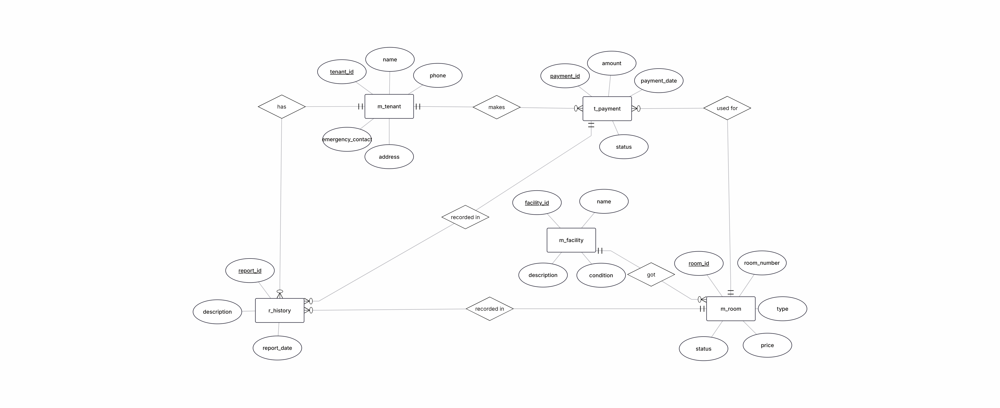
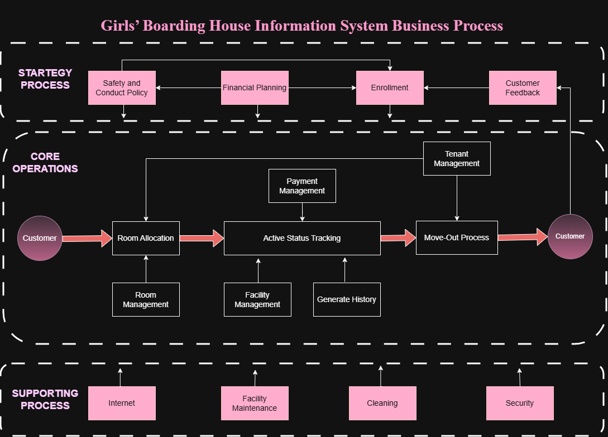

<h1 align="center">
  
  Girls' Boarding House Information System
</h1>

  

A database systems practicum project developed to manage girls' boarding house data efficiently using CRUD operations. This project consists of two different implementations:

Python Flask Application
PHP Native Application

Both applications use the same MySQL database structure but are developed using different programming approaches.

# Technologies Used

| Technology | Description                         |
| ---------- | ----------------------------------- |
| PHP Native | Backend programming language        |
| MySQL      | Database management system          |
| HTML5      | Web page structure                  |
| CSS3       | Styling and layout                  |
| JavaScript | Interactive functionality           |
| Bootstrap  | UI components and responsive design |
| LARAGON    | Local server environment            |

# Entity Relationship Diagram (ERD)

# Business Process Diagram

# Installation Guide

## 1. Clone Repository

git clone https://github.com/rentsaisy/boardingHouse-using-PHP.git

## 2. Move Project Folder

Move the project folder into the Laragon `www` directory:

C:\laragon\www\

Example:

C:\laragon\www\boardingHouse-using-PHP

## 3. Import Database

Import the SQL file into phpMyAdmin.

boardinghouse-db.sql

## 4. Start Laragon

Open Laragon and click:

* Start All

Make sure:

* Apache is running
* MySQL is running

## 5. Open Application in Terminal
### Python Flask Application

Open terminal in the project folder, then run:

python app.py

Or:

flask run

### PHP Native Application (Laragon)

Open terminal in the project folder, then run:

php -S localhost:8000

Open browser:

http://localhost:8000

Or if using Laragon normally, simply place the project inside:

C:\laragon\www\

then click **Start All** in Laragon and access:

http://localhost/project-folder-name

# License

This project is for educational purposes only.
